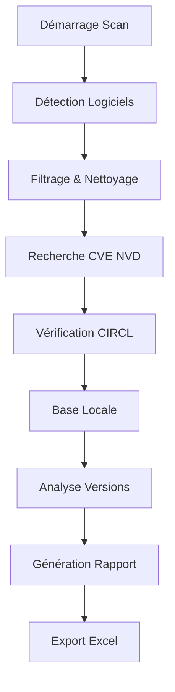

# VulSCAN-o2Cloud 🛡️

[](https://github.com/o2Cloud-fr/VulSCAN-o2Cloud)
[](LICENSE)
[](https://github.com/o2Cloud-fr/VulSCAN-o2Cloud)
[](https://electronjs.org/)
[](https://github.com/o2Cloud-fr/VulSCAN-o2Cloud)

Un scanner de vulnérabilités avancé pour Windows, développé avec Electron, qui analyse automatiquement les logiciels installés et identifie les failles de sécurité potentielles via des bases de données CVE reconnues.

## 🚀 Fonctionnalités

### 🔍 Détection Automatique
- **Scan complet du système** : Détection automatique via registre Windows et PowerShell
- **Applications Microsoft Store** : Support des applications UWP
- **Logiciels 32-bit et 64-bit** : Analyse complète des deux architectures
- **Filtrage intelligent** : Élimination des doublons et faux positifs

### 🌐 Sources CVE Multiples
- **🏛️ NVD (National Vulnerability Database)** : Base officielle NIST
- **🔄 CIRCL CVE** : Base européenne de vulnérabilités
- **📊 Base locale** : Règles personnalisées et heuristiques
- **🔀 Système de fallback** : Basculement automatique entre sources

### 🎯 Analyse Avancée
- **Vérification de version précise** : Comparaison intelligente des versions
- **Score CVSS** : Évaluation standardisée des risques
- **Filtrage temporel** : Exclusion des CVE obsolètes
- **Correspondance CPE** : Identification précise des produits

### 📊 Reporting Professionnel
- **Export Excel avancé** : Rapport détaillé avec métadonnées
- **Tri par sévérité** : Classification automatique des risques
- **Interface temps réel** : Suivi en direct du scan
- **Historique complet** : Conservation des analyses précédentes

## 📋 Prérequis

### Système
- **OS** : Windows 10/11 (64-bit recommandé)
- **RAM** : 4 GB minimum, 8 GB recommandé
- **Espace disque** : 500 MB libres
- **Connexion Internet** : Requise pour les API CVE

### Environnement de développement
- **Node.js** : v16.x ou supérieur
- **npm** : v8.x ou supérieur
- **PowerShell** : v5.0+ (inclus dans Windows)
- **Permissions** : Administrateur recommandé

## 🛠️ Installation

### Installation Rapide

```bash
# Cloner le repository
git clone https://github.com/o2Cloud-fr/VulSCAN-o2Cloud.git
cd VulSCAN-o2Cloud

# Installer les dépendances
npm install

# Lancer en mode développement
npm run dev
```

### Build de Production

```bash
# Build pour Windows
npm run build

# Package portable (sans installation)
npm run pack

# Créer l'installeur Windows
npm run dist
```

## 📁 Structure du Projet

```
VulSCAN-o2Cloud/
├── 📄 main.js                 # Processus principal Electron
├── 🎨 index.html             # Interface utilisateur
├── 🖼️ assets/
│   ├── icon.png              # Icône application
│   └── screenshots/          # Captures d'écran
├── 📦 dist/                  # Builds de production
├── 📋 package.json           # Configuration npm
└── 📖 README.md              # Documentation
```

## 🎮 Utilisation

### Lancement Initial

1. **Démarrer l'application**
   ```bash
   npm start
   ```

2. **Interface de scan**
   - Cliquer sur "Démarrer le Scan"
   - Patienter pendant la détection (2-5 minutes)
   - Consulter les résultats en temps réel

### Workflow de Sécurité



### Options Avancées

#### Configuration API
```javascript
// Personnalisation des sources CVE
const apiConfig = {
    nvd: {
        baseUrl: 'https://services.nvd.nist.gov/rest/json/cves/2.0',
        timeout: 30000,
        rateLimit: 2000
    },
    circl: {
        baseUrl: 'https://cve.circl.lu/api',
        timeout: 15000,
        rateLimit: 3000
    }
};
```

#### Filtres de Scan
```javascript
// Exclusion de logiciels spécifiques
const scanConfig = {
    excludePatterns: [
        'Microsoft Visual C++',
        'Windows SDK',
        'DirectX'
    ],
    maxAge: 15, // CVE plus anciennes que 15 ans ignorées
    minScore: 0.0 // Score CVSS minimum
};
```

## 📊 Types de Vulnérabilités Détectées

### Catégories Principales

| Sévérité | Score CVSS | Description | Exemple |
|----------|------------|-------------|---------|
| 🔥 **Critical** | 9.0-10.0 | Exploitation à distance sans authentification | RCE, Privilege Escalation |
| 🟥 **High** | 7.0-8.9 | Impact sévère nécessitant une action immédiate | Buffer Overflow, SQLi |
| 🟨 **Medium** | 4.0-6.9 | Risque modéré, correction recommandée | XSS, Information Disclosure |
| 🟩 **Low** | 0.1-3.9 | Impact limité, surveillance nécessaire | DoS local, Weak Crypto |

### Sources de Données

- **🏛️ NVD** : 200,000+ CVE officielles US-CERT
- **🇪🇺 CIRCL** : Base européenne complémentaire
- **📚 Local** : Règles métier personnalisées
- **🔄 Temps réel** : Mise à jour continue

## 🚨 Sécurité & Confidentialité

### Protection des Données
- ✅ **Aucune collecte** de données personnelles
- ✅ **Scan local** : aucune information système transmise
- ✅ **API publiques** uniquement pour les CVE
- ✅ **Chiffrement HTTPS** pour toutes les requêtes

### Recommandations
- Exécuter avec privilèges administrateur
- Maintenir une connexion Internet stable
- Effectuer des scans réguliers (hebdomadaires)
- Conserver les rapports pour suivi

## 📈 Performance & Optimisation

### Métriques Typiques
- **500 logiciels** : ~15-20 minutes
- **Rate limiting** : 2-3 secondes entre requêtes
- **Mémoire** : <200 MB utilisation
- **CPU** : Impact minimal (1-5%)

### Optimisations Intégrées
```javascript
// Gestion intelligente des erreurs
const adaptiveDelay = {
    baseDelay: 3000,
    maxDelay: 15000,
    backoffMultiplier: 1.5,
    errorThreshold: 3
};

// Cache local temporaire
const cacheConfig = {
    ttl: 3600000, // 1 heure
    maxEntries: 1000,
    persistent: false
};
```

## 🤝 Contribution

### Développement Local

```bash
# Fork du projet
git clone https://github.com/o2Cloud-fr/VulSCAN-o2Cloud.git

# Créer une branche feature
git checkout -b feature/nouvelle-fonctionnalite

# Développement avec hot-reload
npm run dev

# Tests et validation
npm run test

# Commit et push
git commit -m "feat: ajout nouvelle fonctionnalité"
git push origin feature/nouvelle-fonctionnalite
```

### Standards de Code

- **ESLint** : Configuration stricte incluse
- **Prettier** : Formatage automatique
- **JSDoc** : Documentation du code
- **Tests** : Couverture minimum 80%

### Types de Contributions

- 🐛 **Bug fixes** : Correction de problèmes
- ✨ **Features** : Nouvelles fonctionnalités
- 📚 **Documentation** : Amélioration docs
- 🎨 **UI/UX** : Améliorations interface
- 🔧 **Performance** : Optimisations
- 🛡️ **Security** : Renforcement sécurité

## 🚧 Roadmap

### Version 2.1 (Q2 2025)
- [ ] Support Linux/macOS
- [ ] API REST intégrée
- [ ] Scan réseau distant
- [ ] Dashboard web

### Version 2.2 (Q3 2025)
- [ ] Intelligence artificielle
- [ ] Prédiction de vulnérabilités
- [ ] Intégration SIEM
- [ ] Alertes temps réel

### Version 3.0 (Q4 2025)
- [ ] Cloud SaaS
- [ ] Multi-tenancy
- [ ] API publique
- [ ] Mobile companion

## 🐛 Dépannage

### Problèmes Courants

#### Aucun logiciel détecté
```powershell
# Vérifier les permissions PowerShell
Get-ExecutionPolicy
Set-ExecutionPolicy -ExecutionPolicy RemoteSigned -Scope CurrentUser
```

#### Erreurs API CVE
```bash
# Vérifier la connectivité
curl -I https://services.nvd.nist.gov/rest/json/cves/2.0
ping cve.circl.lu
```

#### Performance lente
```javascript
// Réduire le scope de scan
const quickScanConfig = {
    maxSoftware: 100,
    skipStoreApps: true,
    priorityOnly: true
};
```

### Support & Debug

```bash
# Logs détaillés
npm run dev -- --verbose

# Mode debug complet
DEBUG=* npm start

# Analyse performance
npm run profile
```

## 📞 Support

### Communauté
- 💬 **Discussions** : [GitHub Discussions](https://github.com/o2Cloud-fr/VulSCAN-o2Cloud/discussions)
- 🐛 **Issues** : [Bug Reports](https://github.com/o2Cloud-fr/VulSCAN-o2Cloud/issues)
- 📧 **Email** : github@o2cloud.fr

### Documentation
- 📖 **Wiki** : [Documentation complète](https://github.com/o2Cloud-fr/VulSCAN-o2Cloud/wiki)
- 🎥 **Tutorials** : [Chaîne YouTube](#)
- 📝 **Blog** : [Articles techniques](#)

## 👥 Équipe

### Mainteneurs Principaux
- **[@o2Cloud-fr](https://github.com/o2Cloud-fr)** - Créateur & Lead Developer
  - 📧 Email: github@o2cloud.fr
  - 🏢 Organisation: o2Cloud France
  - 🌐 Website: [o2cloud.fr](https://o2cloud.fr)

### Contributeurs
Un grand merci à tous nos [contributeurs](https://github.com/o2Cloud-fr/VulSCAN-o2Cloud/graphs/contributors) ! 🙏

## 📄 Licence

Ce projet est sous licence **MIT** - voir le fichier [LICENSE](LICENSE) pour plus de détails.

```
MIT License - Copyright (c) 2025 o2Cloud-fr

Permission is hereby granted, free of charge, to any person obtaining a copy
of this software and associated documentation files (the "Software"), to deal
in the Software without restriction, including without limitation the rights
to use, copy, modify, merge, publish, distribute, sublicense, and/or sell
copies of the Software, and to permit persons to whom the Software is
furnished to do so, subject to the following conditions:

The above copyright notice and this permission notice shall be included in all
copies or substantial portions of the Software.
```

## 🙏 Remerciements

### Technologies Utilisées
- **[Electron](https://electronjs.org/)** - Framework d'application desktop
- **[Node.js](https://nodejs.org/)** - Runtime JavaScript
- **[ExcelJS](https://github.com/exceljs/exceljs)** - Génération Excel
- **[Axios](https://axios-http.com/)** - Client HTTP

### Sources de Données
- **[NIST NVD](https://nvd.nist.gov/)** - National Vulnerability Database
- **[CIRCL CVE](https://cve.circl.lu/)** - Computer Incident Response Center
- **[MITRE CVE](https://cve.mitre.org/)** - Common Vulnerabilities and Exposures

### Inspirations
- **[Nessus](https://www.tenable.com/products/nessus)** - Scanner de vulnérabilités professionnel
- **[OpenVAS](https://www.openvas.org/)** - Scanner open source
- **[Nuclei](https://nuclei.projectdiscovery.io/)** - Engine de détection moderne

---

<div align="center">

**⭐ Si ce projet vous aide, n'hésitez pas à lui donner une étoile ! ⭐**

[](https://github.com/o2Cloud-fr/VulSCAN-o2Cloud/stargazers)
[](https://github.com/o2Cloud-fr/VulSCAN-o2Cloud/network/members)
[](https://github.com/o2Cloud-fr/VulSCAN-o2Cloud/watchers)

Made with ❤️ by **[o2Cloud-fr](https://github.com/o2Cloud-fr)**

</div>